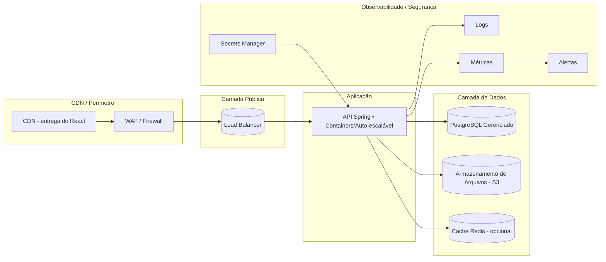
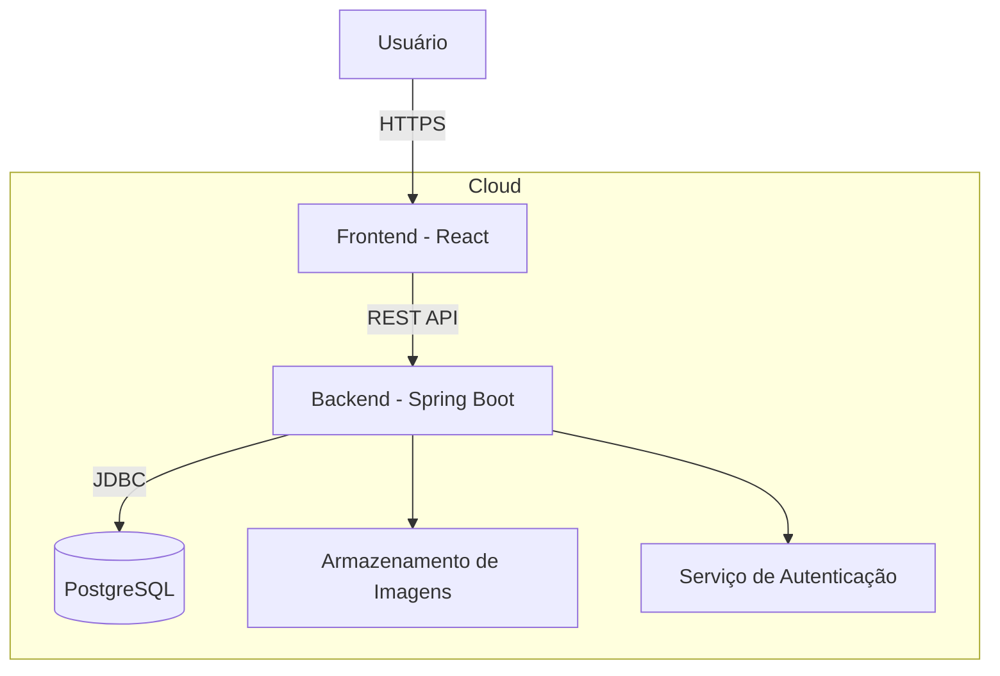

# 🍺 | Gomes Cachaçaria e Artesanato - Backend Ecommerce

Este repositório contém o backend do sistema de e-commerce da Gomes Cachaçaria e Artesanato, especializado na venda de cachaças artesanais e produtos relacionados.
O objetivo é fornecer uma API robusta, escalável e segura para suportar as operações de vendas, gestão de produtos, clientes e pedidos.

---

## 🖇️ | Índice

1. [Sobre](#sobre)
2. [Arquitetura](#arquitetura)
3. [Documentação](#documentacao)
4. [Entregas](#entregas)
5. [Instalação e Execução](#instalacao-e-execucao)
6. [Links Úteis](#links-uteis)
7. [Equipe](#equipe)
8. [Licença](#licenca)

---

## ❓ | Sobre

Este repositório apresenta o desenvolvimento de um sistema de e-commerce voltado à comercialização de cachaças artesanais e produtos relacionados, elaborado no contexto da disciplina de Programação Orientada a Objetos (POO). O projeto adota uma abordagem orientada a requisitos e foi estruturado a partir de histórias de usuário, descritas em linguagem clara e concisa, com cenários de validação definidos segundo o método BDD (Behavior-Driven Development), assegurando a entrega de valor alinhada às necessidades do negócio.

As histórias contemplam tanto o front-office (visitante/cliente) quanto o back-office (administrador/gestor), abrangendo desde o acesso e navegação em uma página inicial intuitiva, cadastro de clientes, até funcionalidades de gestão administrativa, como cadastro de produtos, controle de estoque, acompanhamento de pedidos e visualização de histórico.

O sistema foi concebido para ser robusto, escalável e de fácil manutenção, priorizando a qualidade do código, a clareza da arquitetura e a rastreabilidade de todas as operações realizadas.

## ❓ | Tecnologias Utilizadas

### Backend

* Java
* Spring Boot
* JPA/Hibernate

### Frontend

* React
* JavaScript
* CSS Modules e CSS geral
* Fetch API

### Infraestrutura e Banco de Dados

* PostgreSQL
* Render.com
* pgAdmin 4

### Outras (auxiliares)

* Figma
* Trello
* GitHub e Git
* Canva

---

## 🏗️ | Arquitetura

A arquitetura do sistema foi estruturada visando escalabilidade, segurança, disponibilidade, robustez e monitoramento.

---

## 📂 | Documentação

Relatório contendo processo de desenvolvimento do projeto.

[🔗 Link](https://docs.google.com/document/d/1Ib6jJTVic5LUr9_o7C9ZTKErE26WM4vBt5e1zu12kv0/edit?usp=drivesdk)

---

## 📦 | Entregas

...

---

## 📥 | Instalação e Execução

Como instalar e montar o ambiente corretamente para execução do programa em sua máquina?

---

## 🔗 | Links Úteis

[Trello](https://trello.com/invite/b/68acb95bb432514982af6a20/ATTIc817d2314530f4f243989ed652e30f7dCAAA0488/projeto-cachacaria)

[Relatório de Desenvolvimento](https://docs.google.com/document/d/1Ib6jJTVic5LUr9_o7C9ZTKErE26WM4vBt5e1zu12kv0/edit?usp=drivesdk)

[Figma](https://www.figma.com/file/13gNLKF5izmAHEUwjIQeQN?node-id=0:1&locale=pt-br&type=design)

---

## 👥 | Equipe

* Aline de Albuquerque Henriques
* Bruno Felipe de Castilhos Gomes Rego
* Allan Ronald
* Thyalles Araújo Campos

---

## 📜 | Licença

Este projeto está licenciado sob a licença MIT.

## 🏛️ | Arquitetura do Sistema

